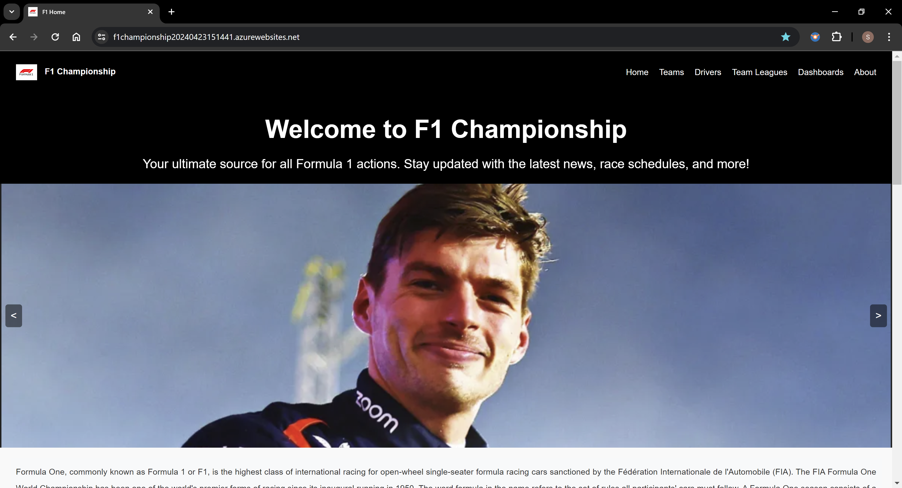
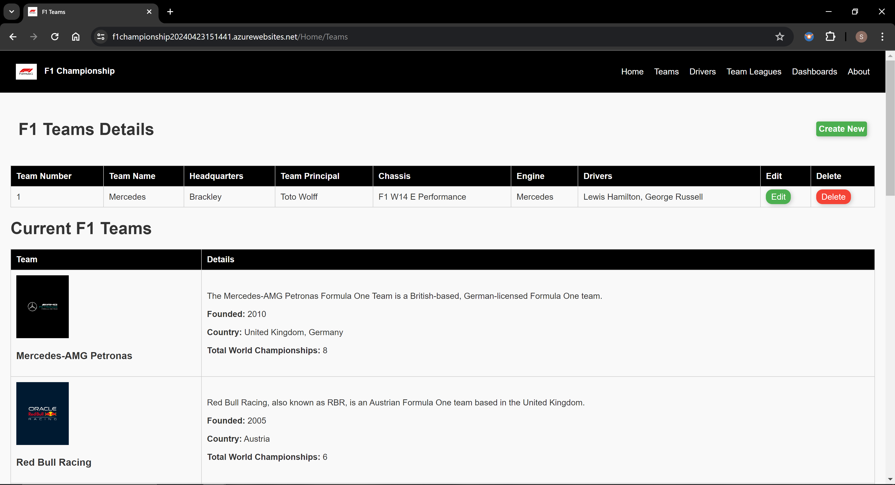
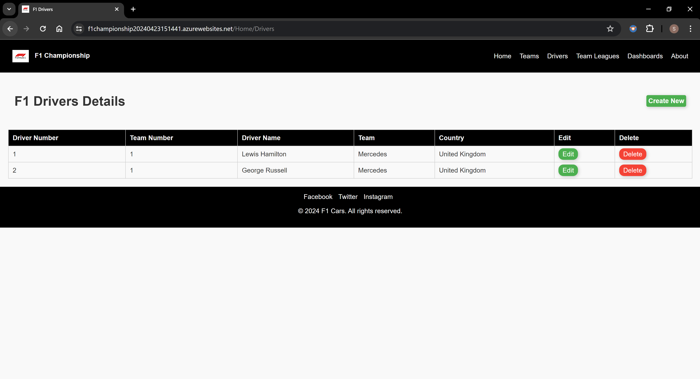
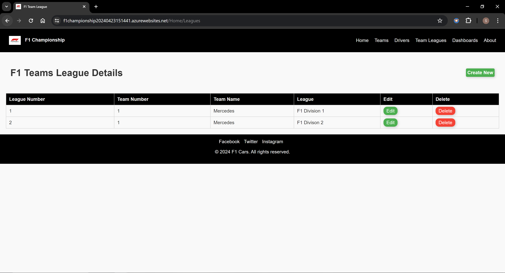
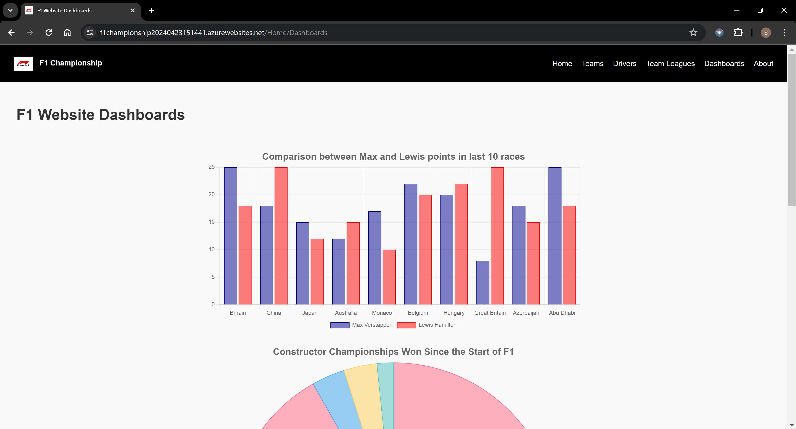

# F1 Championship | Software Engineering MVC Project 

This project provides comprehensive online platform dedicated to the Formula 1 championship.

Formula One, commonly known as Formula 1 or F1, is the highest class of international racing for open-wheel single-seater formula racing cars sanctioned by the Fédération Internationale de l'Automobile (FIA). The FIA Formula One World Championship has been one of the world's premier forms of racing since its inaugural running in 1950. The word formula in the name refers to the set of rules all participants' cars must follow. A Formula One season consists of a series of races, known as Grands Prix. Grands Prix take place in multiple countries and continents on either purpose-built circuits or closed public roads.

## Data Model

## Home Page

## Teams Page

## Drivers Page

## Team Leagues Page

## Dashboards

